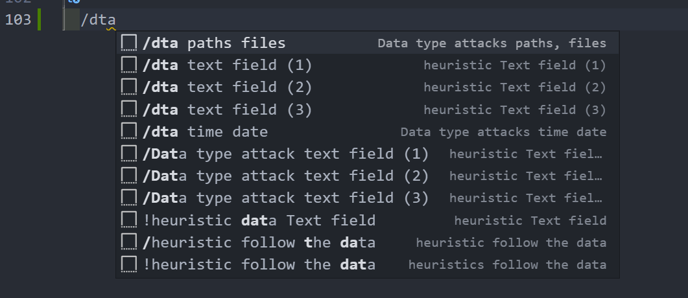
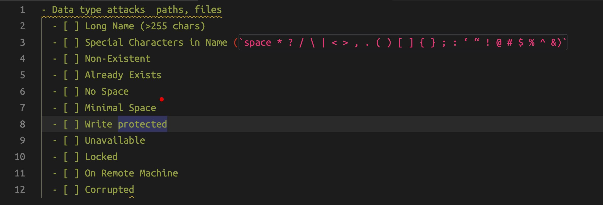
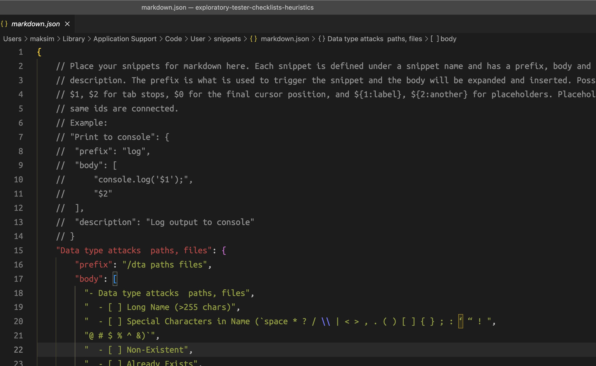

# Exploratory tester checklists heuristics

VS Code snippets created using <https://www.ministryoftesting.com/articles/5631d7b0?s_id=14717348> and test heuristics cheatsheet by Elisabeth Hendrickson, James Lyndsay, Dale Emery. See pdf files in `attachments` folder.

## Links

1. [GitHub - ckenst/testing-guides: A set of guides and catalogs to help test software](https://github.com/ckenst/testing-guides)
2. [Checklist for Testing Web Page Functionality | Ministry of Testing](https://www.ministryoftesting.com/articles/5631d7b0?s_id=14717348)
3. [Snippet generator](https://snippet-generator.app/)

## Install

Copy snippets from markdown.json in this repo to your markdown.json file.

## Usage

Example 1:

1. Start typing in VS code editor `/dta paths file`.
2. Select option fom suggestions.
3. Press enter
4. Snippet will be inserted

Markdown file:  

Result:  

markdown.json:  

## Data type attacks

- Data type attack text field (1)
  - prefix: `/dta text field 1`
  - [ ] valid data
  - [ ] invalid data
  - [ ] letters
  - [ ] numbers
  - [ ] blank or empty
  - [ ] mandatory fields
- Data type attack text field (2)
  - prefix: `/dta text field 2`
  - [ ] minimum and maximum length
  - [ ] space
  - [ ] long (64, 255, 256, 257, 1000, 1024, 2000, 2048 or more characters)
  - [ ] short (1,2, 3 characters)
  - [ ] one word
  - [ ] multiple words
- Data type attack text field (3)
  - prefix: `/dta text field 3`
  - [ ] space leading/trailing/in the middle
  - [ ] tabs
  - [ ] null value
  - [ ] special characters (such as<!#$|%)
  - [ ] emojis 😀👍
  - [ ] line break
- Data type attack format exploits (4)
  - prefix: `/dta text field 4`, `/dta format exploits`
  - [ ] html-tags `<blink>Hello there</blink>`
  - [ ] js injection ``
  - [ ] js injection single quote `'-prompt()-'`
  - [ ] broken html `<i><b>Bold</i></b>`
  - [ ] sql injection `and  ‘1’=’1`
  - [ ] sql injection `admin'--`
- Data type attack (5)
  - prefix: `/dta text field 5`, `/dta text field 5`
  - [ ] accessibility: tab navigation
  - [ ] existing value
  - [ ] Hidden text
  - [ ] Usability: Different browsers
  - [ ] Usability: Browser zoom in/out
  - [ ] Security: Extremely big requests
  - [ ] Scenario: "nasty words"
- Data type attack  paths, files
  - prefix `/dta paths file◊s`
  - [ ] Long Name (>255 chars)
  - [ ] Special Characters in Name (`space * ? / \ | < > , . ( ) [ ] { } ; : ‘ “ !
@ # $ % ^ &`)
  - [ ] Non-Existent
  - [ ] Already Exists
  - [ ] No Space
  - [ ] Minimal Space
  - [ ] Write protected
  - [ ] Unavailable
  - [ ] Locked
  - [ ] On Remote Machine
  - [ ] Corrupted
- Data type attack time and date
  - prefix `/dta time date`
  - [ ] Timeouts
  - [ ] Time Difference between Machines
  - [ ] Crossing Time Zones
  - [ ] Leap Days, leap years
  - [ ] Always Invalid Days (Feb 30, Sept 31)
  - [ ] Feb 29 in Non-Leap Years
  - [ ] Different Formats (June 5, 2001; 06/05/2001; 06/05/01; 06-05-01; 6/5/2001 12:34)
  - [ ] Daylight Savings
  - [ ] Changeover
  - [ ] Reset Clock Backward or Forward
- Data text size with spaces
  - prefix `/dts w spaces`
  - [ ] 128b:`Lorem ipsum dolor sit amet, consectetur adipiscing elit, sed do eiusmod tempor incididunt ut labore et dolore magna aliqua.Lorem`
  - [ ] 129b:`Lorem ipsum dolor sit amet, consectetur adipiscing elit, sed do eiusmod tempor incididunt ut labore et dolore magna aliqua.Lorem`

## Heuristics

- Quality areas
  - prefix `/heuristic quality areas`
  - (C) capability
  - (R) reliability
  - (U) usability
  - (C) charisma
  - (S) security
  - (S) scalability
  - (C) compatibility
  - (P) performance
  - (I) installability
  - (D) development
- Heuristic SFDIPOT
  - prefix `/heuristic SFDIPOT`
  - (S) structure
  - (F) function
  - (D) data
  - (I) interfaces
  - (P) platform
  - (O) operations
  - (T) time
- Heuristic CRUD
  - prefix `/heuristic CRUD`
  - (C) create
  - (R) read
  - (U) update
  - (D) delete
- Heuristic FDSFSCURA
  - prefix: `/heuristic FDSFSCURA`
  - (F) functional testing
  - (D) domain testing
  - (S) stress testing
  - (F) flow testing
  - (S) scenario testing
  - (C) claims testing
  - (U) user testing
  - (R) risk testing
  - (A) automated checking
- Heuristic HICCUPS
  - prefix: `/heuristic HICCUPS`
  - (H) history
  - (I) image
  - (C) comparable products
  - (C) claims
  - (U) user's expectations
  - (P) product itself
  - (P) purpose
  - (S) statutes
- Heuristic CRUCSS-CPID
  - prefix: `/heuristic CRUCSS-CPID`
  - (C) capability
  - (R) reliability
  - (U) usability
  - (C) charisma
  - (S) security
  - (S) scalability
  - (C) compatibility
  - (P) performance
  - (I) installability
  - (D) development
- Heuristic follow the data
  - prefix: `/heuristic follow the data`
  - Perform a sequence of actions involving data, verifying the data integrity at each step.
  - (Example: Enter → Search → Report → Export → Import → Update → View)
- Heuristic interruptions
  - prefix: `/heuristic interruptions`
  - Perform actions that interrupt some workflow, verifying that system or module gracefully system handles such events
  - Log Off, Shut Down, Reboot, Kill Process, Disconnect, Hibernate, Timeout, Cancel
- Heuristic dependencies
  - prefix: `/heuristic dependencies`
  - Identify “has a” relationships (a Customer has an Invoice; an Invoice has multiple Line Items). Apply CRUD, Count, Position, and/or Selection heuristics (Customer has 0, 1, many Invoices; Invoice has 0, 1, many Line Items; Delete last Line Item then Read; Update first Line Item; Some, None, All Line Items are taxable; Delete Customer with 0, 1, Many Invoices)
- Heuristics list
  - prefix: `/heuristics list`
  - HICCUPS
  - SFDIPOT
  - CRUD
  - FDSFSCURA
  - CRUCSS-CPID
  - Follow the data
  - Interruptions
  - Goldilocks
  - Boundaries
  - Dependencies
  - Constraints
  - Input Method
  - State Analysis
  - Users & Scenarios

## Test types

- Basic test types
  - prefix `/testing types`
  - [ ] Basic positive tests (happy paths)
  - [ ] Extended positive testing with optional parameters
  - [ ] Negative testing with valid input (for example, trying to add an existing username)
  - [ ] Negative testing with invalid input (trying to add a username which is null)
  - [ ] Destructive testing (for example, fill in long text into input field).
  - [ ] UI verification.
  - [ ] Accessibility testing.
  - [ ] Usability testing
  - [ ] Security (session management, link expiry, error handling).
  - [ ] Mobile testing: verify UI layout (elements overlapping, misaligned, no white space) modals, menus
